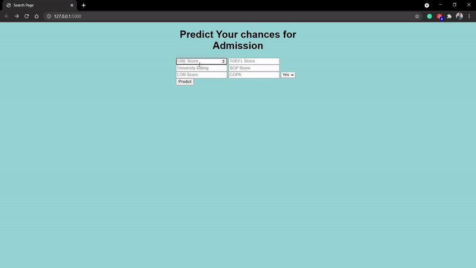

# Admission Prediction Application

[]
<br/>

__I started this self motivated project to explore and implement ML algorithms (SVM), Flask with Python.__

####Note :- 
Different colleges may have different criteria for admission (like some may require high GRE score, some may require low)
In this project, We are avoiding such differences

## Inputs for Predicting the chance of admission at college

1. GRE Score /320
2. TOEFL Score /120
3. University Rating /5
4. SOP Score /5
5. LOR Score /5 
6. CGPA Score /10.0
7. Internship - (Yes/No)

##Goal - 
Create an application where students can know the chances of their admission in college just by entering the exam score and other details.

##Solution - 
Create a regression model based on previous available data (SVM with Hyperparameters tuning in this case) and deploy model on GCP.

##Result - 
We got the test r2 score of 0.7457 which is a decent score for predicting chances of selection in desired college.

## Get Started

### Pre-installation
```
pip install -r requirements.txt
```
